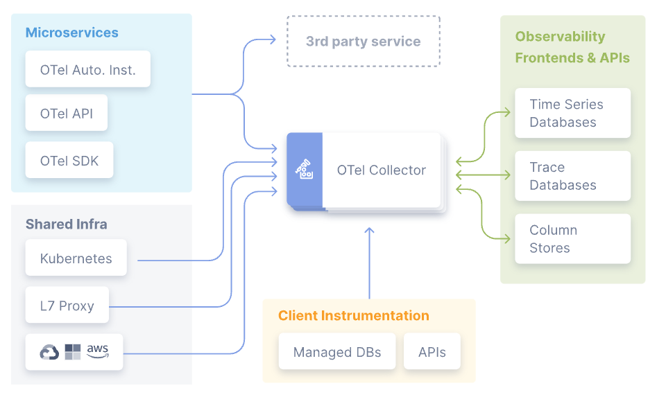
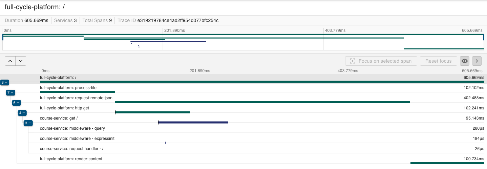

# OpenTelemetry

High-quality, ubiquitous, and portable telemetry to enable effective observability.

[OpenTelemetry](https://opentelemetry.io/) is a collection of APIs, SDKs, and tools. You can use it to instrument, generate, collect, and export telemetry data (metrics, logs, and traces) to help you analyze your software’s performance and behavior. This facilitates seamless integration with various monitoring services, including Datadog, Grafana, Sentry, and New Relic.

## Main Components

OpenTelemetry is currently made up of several main components:

- **Specification:** Describes the cross-language requirements and expectations for all implementations. Beyond a definition of terms, the specification defines the following: API, SDK, and Data.
- **Collector:** It is a vendor-agnostic proxy that can receive, process, and export telemetry data. It can work as a side car or as a separate service within your infrastructure.
- **Language-specific API & SDK implementations** It lets you use the OpenTelemetry API to generate telemetry data with your language of choice and export that data to a preferred backend.
- **K8s operator:** It is an implementation of a Kubernetes Operator. The operator manages the OpenTelemetry Collector and auto-instrumentation of the workloads using OpenTelemetry.
- **Function as a Service assets:** Platforms that enable the development and execution of cloud-based programs. OpenTelemetry's community assets allow you to instrument and gain observability into the features, functions and applications you develop on FaaS platforms.

## Instrumentation

Instrumentation is essential for making a system observable, involving the emission of traces, metrics, and logs from its components. OpenTelemetry offers two primary methods for instrumentation:

- **Code-based solutions:** These involve using official APIs and SDKs for various programming languages. They enable deep insight into the application, allowing the generation of rich telemetry directly from the code. This complements the telemetry produced by zero-code solutions.
- **Zero-code solutions:** Ideal for quick start-ups or situations where modifying the application isn't feasible. These solutions provide detailed telemetry from libraries and the application environment, offering insights into the periphery of the application.

It's important to mention that depending on the language you are using Zero-code solutions might not be available. Refer to the OpenTelemetry docs for more information.

## Running locally

1. Clone this repo
1. Run `docker compose up -d`
1. Access `http://localhost:8888/`
1. And you'll be able to see the entire tracing of you request at `http://localhost:9411/`
